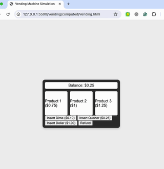
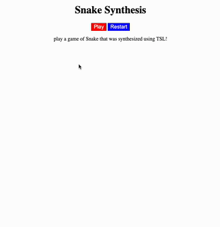
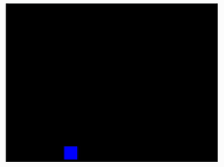

# TSL LLM Benchmark
Code gen models struggle with long context generation, and have been shown to perform better when using code snippets to condition output. We propose a novel approach that uses LLMs to generate TSL specs which are then synthesized to code. The LLM then uses the synthesized code as a seed code to generate the desired program. 

## Benchmark Overview
We propose a set of benchmarks to test the capability of LLMs in generating TSL specs for reactive synthesis. The benchmarks use a simple TSL spec to generate complex state machines, and are designed to test the ability of LLMs to generate specs as opposed to generating entire state machines. In this way performance of long context high risk code gen applications can be simplified and made more transparent. **The snake death is due to user error... The final death is due to illegal keypresses and not a bug.**

| **Ball** | **Game of Life** | **Vending Machine** | 
|:--------:|:-------:|:-----------:|
|  |  |  | 

|**Snake Game** | **Space Invaders (ship only)** |          **Rotating Cube**          |
|:--------:|:-------:|:-----------:|
| |  |  |

## Using the benckmarks and overview
Each folder contains a set of files that make up a benchmark. Call run.py from the main dir to walk through the process of a benchmark.

### Demo:

### File Organization

**Root Directory:** The files in the root directory are used for the generation of any state machine. For each particular state machine, there is a folder with the model-specific files. The state machines created each serve as a benchmark.

-   _Impl_template.prompt_: The template to be filled in by _wrapper_template.html_ and _Headers.txt_ to create _Impl.prompt_.
-   _run.py_: Runs the program. Takes files from a benchmark folder which aren't in the _computed_ folder and creates the files of the _computed_ folder.
-   _shotPrompt.txt_: A text file which provides documentation for TSL and NL->TSL examples. This can help the model with ICL and improves NL to TSL translation.
-   _Spec_template.prompt_: The prompt template which is used as the query to the LLM in order to generate the TSL specification.

**Benchmark Folders:** The files within each folder (e.g. Ball, GameOfLife, etc.) are used to create that benchmark.

-   _NL.summary.txt_: The natural language, high-level summary of the benchmark.
-   _NL.txt_: The natural language description of the benchmark with a clear list of requirements (Assumptions & Guarantees).
-   _Headers.txt_: The function and predicate term header definitions.
-   _wrapper_template.html_: The template html file that the LLM will implement from the _Impl.js_ and _Synth.js_ files that it generates.
-   _computed_: This folder contains files generated by the LLM (this is where the benchmark part comes in).
    -   _Spec.tsl_: The TSL specification that the LLM generates.
    -   _Spec.prompt_: The prompt which is used to query the LLM for a TSL specification.
    -   _Impl.prompt_: The prompt which is used to query the LLM for a javascript implementation of the function and predicates.
    -   _Synth.js_: The javascript translation from the LLM generated TSL specification. This translation is performed by the [TSL API](https://barnard-pl-labs.github.io/tsl-api/).
    -   _<BENCHMARK_NAME>.html_: The LLM generated html implementation.

### Benchmark Walkthrough

1. _NL.txt_, _NL.summary.txt_, and _Headers.txt_ are handmade and used to fill in _Spec_template.prompt_ and create _Spec.prompt_, which is fed into the LLM.
2. The LLM outputs _Spec.tsl_, its formulation of TSL.
3. This TSL specification is passed into the [TSL API](https://barnard-pl-labs.github.io/tsl-api/) and a javascript translation is stored in _Synth.js_.
4. The handmade _Headers.txt_ is used to fill in _Impl_template.prompt_ and create _Impl.prompt_, which is fed into the LLM.
5. The LLM outputs _Impl.js_, its javascript implementation of the functions and predicates.
6. Finally, using _wrapper_template.html_, _Synth.js_, and _Impl.js_, the LLM fills in _<BENCHMARK_NAME>.html_ for the final benchmark implementation.
7. OPTIONAL: Combine steps 4-6.
